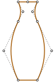
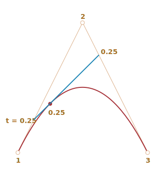

# Courbe de Bézier

Les courbes de Bézier sont utilisées en infographie pour dessiner des formes, pour l'animation CSS et dans bien d'autres domaines.

Ils sont très simples, il suffit de les étudier une fois pour se sentir à l'aise dans le monde des graphiques vectoriels et des animations avancées.

```smart header="Un peu de théorie s'il vous plait"
Cet article fournit un aperçu théorique, mais très nécessaire, de ce que sont les courbes de Bézier, tandis que [le suivant](info:css-animations#bezier-curve) montre comment nous pouvons les utiliser pour les animations CSS.

Veuillez prendre votre temps pour lire et comprendre le concept, il vous servira bien.
```

## Points de contrôle

Une [courbe de Bézier](https://fr.wikipedia.org/wiki/Courbe_de_B%C3%A9zier) est défini par des points de contrôle.

Il peut y en avoir 2, 3, 4 ou plus.

Par exemple, la courbe de deux points:


Courbe à trois points:


Courbe à quatre points:


Si vous regardez attentivement ces courbes, vous pouvez immédiatement remarquer:

1. **Les points ne sont pas toujours sur la courbe.** C'est tout à fait normal, nous verrons plus tard comment la courbe est construite.
2. **L'ordre de la courbe est égal au nombre de points moins un**.
Pour deux points, nous avons une courbe linéaire (c'est une ligne droite), pour trois points -- une courbe quadratique (parabolique), pour quatre points -- une courbe cubique.
3. **Une courbe est toujours à l'intérieur de l'[enveloppe convexe](https://fr.wikipedia.org/wiki/Enveloppe_convexe) de points de contrôle:**

     

Grâce à cette dernière propriété, il est possible, en infographie, d'optimiser les tests d'intersection. Si les enveloppes convexes ne se croisent pas, les courbes ne se croisent pas non plus. Ainsi, vérifier l'intersection des enveloppes convexes en premier lieu peut donner un résultat très rapide "pas d'intersection". La vérification de l'intersection des enveloppes convexes est beaucoup plus facile, car il s'agit de rectangles, de triangles, etc. (voir l'image ci-dessus), des figures beaucoup plus simples que la courbe.

**La principale valeur des courbes de Bézier pour le dessin -- en déplaçant les points, la courbe change *d'une manière intuitive et évidente*.**

Essayez de déplacer les points de contrôle à l'aide d'une souris dans l'exemple ci-dessous:

[iframe src="demo.svg?nocpath=1&p=0,0,0.5,0,0.5,1,1,1" height=370]

**Comme vous pouvez le remarquer, la courbe s'étire le long des lignes tangentielles 1 -> 2 et 3 -> 4.**

Après un peu de pratique, il devient évident de placer les points pour obtenir la courbe voulue. Et en reliant plusieurs courbes, on peut obtenir pratiquement n'importe quoi.

Voici quelques exemples:

  

## L'algorithme de De Casteljau

Il existe une formule mathématique pour les courbes de Bézier, mais nous y reviendrons un peu plus tard, parce que
[l'algorithme de De Casteljau](https://fr.wikipedia.org/wiki/Algorithme_de_Casteljau) est identique à la définition mathématique et montre visuellement comment elle est construite.

Voyons tout d'abord l'exemple de 3-points.

Voici la démo, et l'explication qui suit.

Les points de contrôle (1,2 et 3) peuvent être déplacés par la souris. Appuyez sur le bouton "play" pour l'exécuter.

[iframe src="demo.svg?p=0,0,0.5,1,1,0&animate=1" height=370]

**L'algorithme de De Casteljau pour la construction de la courbe de Bézier à 3 points:**

1. Dessinez des points de contrôle. Dans la démo ci-dessus, ils sont intitulés: `1`, `2`, `3`.
2. Construisez des segments entre les points de contrôle 1 -> 2 -> 3. Dans la démonstration ci-dessus, ils sont <span style="color:#825E28">bruns</span>.
3. Le paramètre `t` passe de `0` à `1`. Dans l'exemple ci-dessus, l'étape `0.05` est atteinte: la boucle parcourt `0, 0.05, 0.1, 0.15, .... 0.95, 1`.

    Pour chacune de ces valeurs de `t`:

    - Sur chaque segment <span style="color:#825E28">brun</span> on prend un point situé sur la distance proportionnelle à `t` de son début. Comme il y a deux segments, nous avons deux points.

        Par exemple, pour `t=0` -- les deux points seront au début des segments, et pour `t=0.25` -- sur les 25% de la longueur du segment depuis le début, pour `t=0.5` -- 50%(le milieu), pour `t=1` -- à la fin des segments.

    - Reliez les points. Sur l'image ci-dessous, le segment de connexion est peint en <span style="color:#167490">bleu</span>.


| Pour `t=0.25`             | Pour `t=0.5`            |
| ------------------------ | ---------------------- |
|    |  |

4. Maintenant, dans le segment <span style="color:#167490">bleu</span> prenez un point sur la distance proportionnelle à la même valeur de `t`. C'est-à-dire que pour `t=0.25` (l'image de gauche) nous avons un point à l'extrémité du quart gauche du segment, et pour `t=0.5` (l'image de droite) -- au milieu du segment. Sur les images ci-dessus, ce point est <span style="color:red">rouge</span>.

5. Comme `t` va de `0` à `1`, chaque valeur de `t` ajoute un point à la courbe. L'ensemble de ces points forme la courbe de Bézier. Elle est rouge et parabolique sur les images ci-dessus.

C'était un processus pour 3 points. Mais c'est la même chose pour 4 points.

La démo pour 4 points (les points peuvent être déplacés à la souris):

[iframe src="demo.svg?p=0,0,0.5,0,0.5,1,1,1&animate=1" height=370]

L'algorithme pour 4 points:

- Relier les points de contrôle par des segments: 1 -> 2, 2 -> 3, 3 -> 4. Il y aura 3 segments <span style="color:#825E28">bruns</span>.
- Pour chaque `t` dans l'intervalle de `0` à `1`:
    - On prend des points sur ces segments sur la distance proportionnelle à `t` depuis le début. Ces points sont reliés, de sorte que nous avons deux <span style="color:#0A0">segments verts</span>.
    - Sur ces segments, nous prenons des points proportionnels à `t`. Nous obtenons un <span style="color:#167490">segment bleu</span>.
    - Sur le segment bleu, on prend un point proportionnel à `t`. Dans l'exemple ci-dessus, c'est <span style="color:red">le point rouge</span>.
- Ces points forment ensemble la courbe.

L'algorithme est récursif et peut être généralisé pour un nombre quelconque de points de contrôle.

Étant donné N de points de contrôle:

1. Nous les connectons pour obtenir initialement N-1 segments.
2. Puis pour chaque `t` de `0` à `1`, on prend un point sur chaque segment sur la distance proportionnelle à `t` et on les relie. Il y aura N-2 segments.
3. Répétez l'étape 2 jusqu'à ce qu'il n'y ait plus qu'un seul point.

Ces points forment la courbe.

```online
**Exécutez et mettez en pause les exemples pour voir clairement les segments et la façon dont la courbe est construite.**
```


Une courbe qui ressemble à `y=1/t`:

[iframe src="demo.svg?p=0,0,0,0.75,0.25,1,1,1&animate=1" height=370]

Les points de contrôle en zig-zag fonctionnent également très bien:

[iframe src="demo.svg?p=0,0,1,0.5,0,0.5,1,1&animate=1" height=370]

Faire une boucle est possible:

[iframe src="demo.svg?p=0,0,1,0.5,0,1,0.5,0&animate=1" height=370]

une courbe de Bézier non lisse (oui, c'est possible aussi):

[iframe src="demo.svg?p=0,0,1,1,0,1,1,0&animate=1" height=370]

```online
Si quelque chose n'est pas clair dans la description de l'algorithme, veuillez consulter les exemples en direct ci-dessus pour voir comment la courbe est construite.
```

Comme l'algorithme est récursif, nous pouvons construire des courbes de Bézier de n'importe quel ordre, c'est-à-dire en utilisant 5, 6 ou plus de points de contrôle. Mais en pratique, de nombreux points sont moins utiles. En général, nous prenons 2 ou 3 points, et pour les lignes complexes, nous collons plusieurs courbes ensemble. C'est plus simple à développer et à calculer.

```smart header="Comment dessiner une courbe par des points donnés ?"
Pour spécifier une courbe de Bézier, on utilise des points de contrôle. Comme nous pouvons le voir, ils ne sont pas sur la courbe, sauf le premier et le dernier.

Parfois, nous avons une autre tâche : dessiner une courbe *par plusieurs points*, de manière à ce qu'ils se trouvent tous sur une seule courbe lisse. Cette tâche s'appelle l'[interpolation numérique](https://fr.wikipedia.org/wiki/Interpolation_num%C3%A9rique), et ici nous ne le traitons pas.

Il existe des formules mathématiques pour de telles courbes, par exemple le [polynôme de Lagrange](https://fr.wikipedia.org/wiki/Interpolation_lagrangienne). En infographie l'[interpolation spline](https://en.wikipedia.org/wiki/Spline_interpolation) est souvent utilisé pour construire des courbes lisses qui relient plusieurs points.
```


## Mathématiques

Une courbe de Bézier peut être décrite à l'aide d'une formule mathématique.

Comme nous l'avons vu, il n'est pas nécessaire de le savoir, la plupart des gens se contentent de dessiner la courbe en déplaçant des points avec la souris. Mais si vous aimez les maths, voici la solution.

Étant donné les coordonnées des points de contrôle <code>P<sub>i</sub></code>: le premier point de contrôle a des coordonnées <code>P<sub>1</sub> = (x<sub>1</sub>, y<sub>1</sub>)</code>, le second: <code>P<sub>2</sub> = (x<sub>2</sub>, y<sub>2</sub>)</code>, et ainsi de suite, les coordonnées de la courbe sont décrites par l'équation qui dépend du paramètre `t` du segment `[0,1]`.

- La formule pour une courbe à 2 points:

    <code>P = (1-t)P<sub>1</sub> + tP<sub>2</sub></code>
- Pour 3 points de contrôle:

    <code>P = (1−t)<sup>2</sup>P<sub>1</sub> + 2(1−t)tP<sub>2</sub> + t<sup>2</sup>P<sub>3</sub></code>
- Pour 4 points de contrôle:

    <code>P = (1−t)<sup>3</sup>P<sub>1</sub> + 3(1−t)<sup>2</sup>tP<sub>2</sub>  +3(1−t)t<sup>2</sup>P<sub>3</sub> + t<sup>3</sup>P<sub>4</sub></code>


Ce sont des équations vectorielles. En d'autres termes, nous pouvons mettre `x` et `y` à la place de `P` pour obtenir les coordonnées correspondantes.

Par exemple, la courbe à 3 points est formée par les points `(x,y)` calculés comme suit:

- <code>x = (1−t)<sup>2</sup>x<sub>1</sub> + 2(1−t)tx<sub>2</sub> + t<sup>2</sup>x<sub>3</sub></code>
- <code>y = (1−t)<sup>2</sup>y<sub>1</sub> + 2(1−t)ty<sub>2</sub> + t<sup>2</sup>y<sub>3</sub></code>

Au lieu de <code>x<sub>1</sub>, y<sub>1</sub>, x<sub>2</sub>, y<sub>2</sub>, x<sub>3</sub>, y<sub>3</sub></code> on devrait mettre les coordonnées de 3 points de contrôle, et ensuite quand `t` se déplace de `0` à `1`, pour chaque valeur de `t` on aura `(x,y)` de la courbe.

Par exemple, si les points de contrôle sont `(0,0)`, `(0.5, 1)` et `(1, 0)`, les équations deviennent:

- <code>x = (1−t)<sup>2</sup> * 0 + 2(1−t)t * 0.5 + t<sup>2</sup> * 1 = (1-t)t + t<sup>2</sup> = t</code>
- <code>y = (1−t)<sup>2</sup> * 0 + 2(1−t)t * 1 + t<sup>2</sup> * 0 = 2(1-t)t = –2t<sup>2</sup> + 2t</code>

Maintenant que `t` va de `0` à `1`, l'ensemble des valeurs `(x,y)` pour chaque `t` forme la courbe pour ces points de contrôle.

## Résumé

Les courbes de Bézier sont définies par leurs points de contrôle.

Nous avons vu deux définitions des courbes de Bézier:

1. Un procédé de dessin : L'algorithme de De Casteljau.
2. Une formule mathématique.

Propriétés intéréssantes des courbes de Bézier:

- Nous pouvons dessiner des lignes lisses avec une souris en déplaçant les points de contrôle.
- Les formes complexes peuvent être constituées de plusieurs courbes de Bezier.

Utilisation:

- En infographie, modélisation, éditeurs de graphiques vectoriels. Les polices sont décrites par des courbes de Bézier.
- Dans le domaine du développement web -- pour les graphiques sur Canvas et au format SVG. À ce propos, les exemples "en direct" ci-dessus sont écrits en SVG. Il s'agit en fait d'un seul document SVG auquel on donne différents points comme paramètres. Vous pouvez l'ouvrir dans une fenêtre distincte et voir la source: [demo.svg](demo.svg?p=0,0,1,0.5,0,0.5,1,1&animate=1).
- Dans les animations CSS, pour décrire la trajectoire et la vitesse de l'animation.
